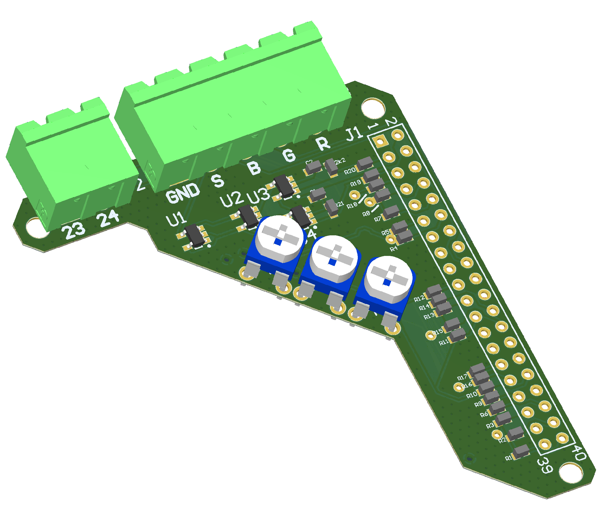

# Boomerang



## Purpose

Boomerang plugs directly into the 40 pin header of a Raspberry Pi and allows for RGBS output, rather than the usual HDMI. This board integrates a Gert VGA 666, and composite sync combiner.

Boomerang also exposes GPIO 23 and GPIO 24 to an external connector, which I'm using to communicate with a [Mausberry Car Supply](https://mausberry-circuits.myshopify.com/).

Three trimpots are installed to allow for slight color correction of the R G and B signals.

Combined with the [Screen Slaver](https://github.com/icecube45/G37ScreenSlaver), Boomerang allows for easy car computer integration into an Infiniti G37.

## Software config
The following must be added to your raspberry pi's config.txt in order to output RGBS video
```
dtoverlay=vga666
enable_dpi_lcd=1
display_default_lcd=1
dpi_group=2
dpi_mode=87
hdmi_timings=480 1 31 35 64 234 1 12 10 10 0 0 0 60 0 9600000 1
```


## Gotchas

* The effective resolution with the Boomerang and supplied config is 480x234. Not great, but actually looks ok on the Infiniti G37 display. If you find a config that allows for a 'higher' resolution, please submit a pull request!


#### Changelog:

* 6/9/2020: Initial Release

